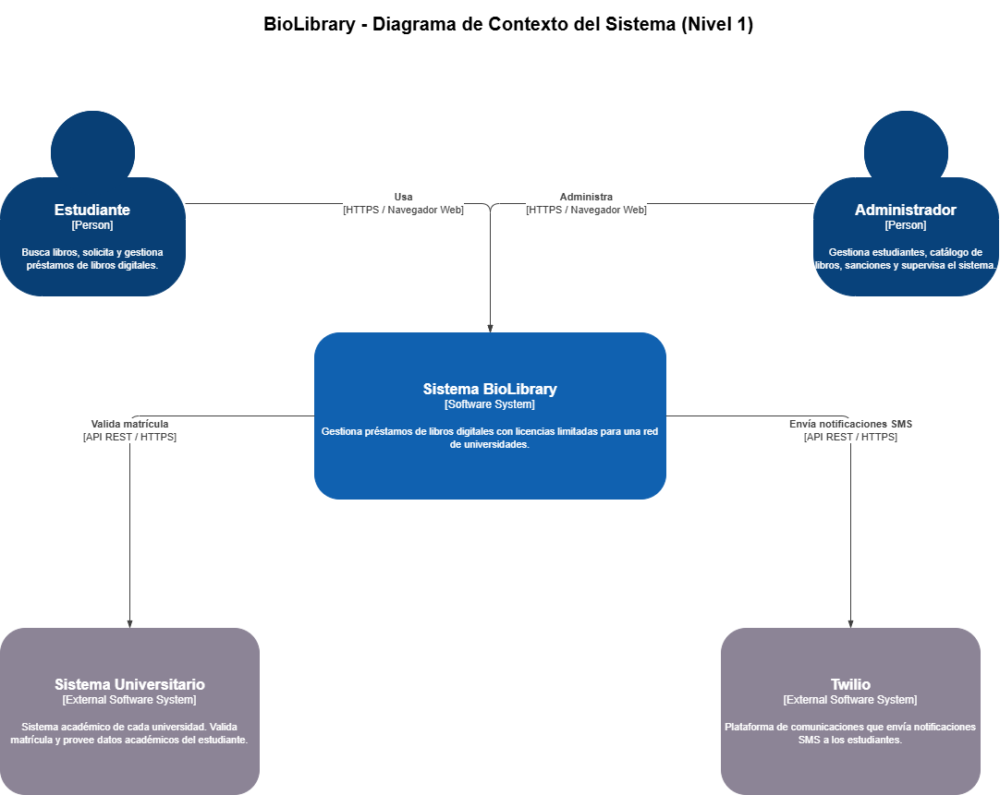
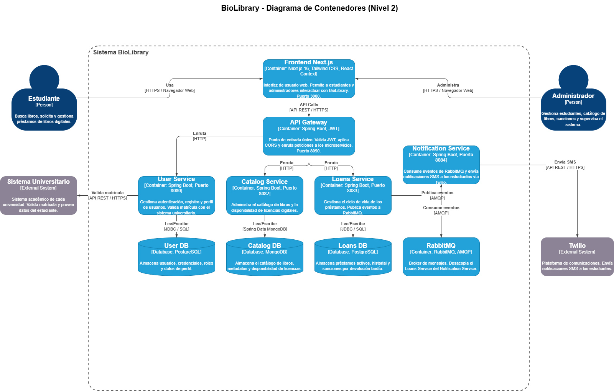

# Diagramas C4

BioLibrary sigue el modelo C4 para documentar la arquitectura en distintos niveles de abstracción.

---

## Nivel 1 — Contexto del Sistema

Muestra el sistema en su entorno: quiénes lo usan y con qué sistemas externos interactúa.

## Nivel 2 — Contenedores

Abre el sistema BioLibrary para mostrar sus contenedores: aplicaciones, servicios, bases de datos y el broker de mensajes.

---

## Leyenda

| Color / Forma         | Significado                    |
| --------------------- | ------------------------------ |
| Azul oscuro (persona) | Usuario del sistema            |
| Azul (rectángulo)     | Contenedor interno del sistema |
| Azul (cilindro)       | Base de datos interna          |
| Gris (rectángulo)     | Sistema externo                |
